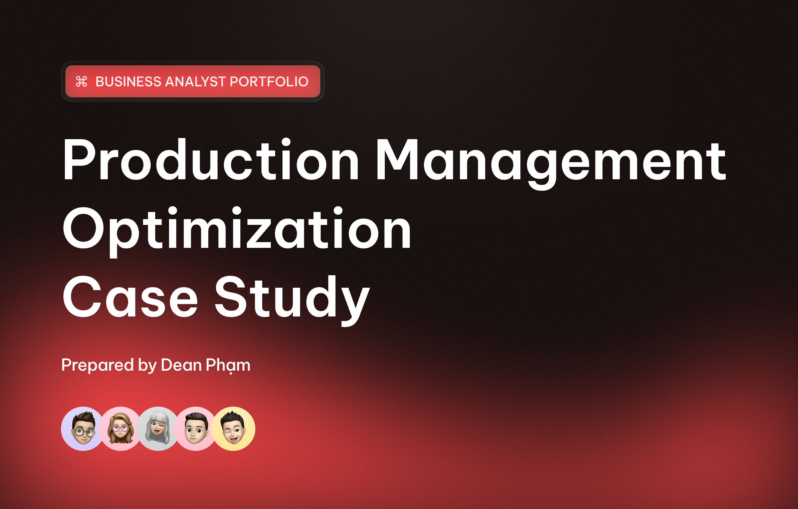

# 🏭 Production Management Optimization Case  
**A Business Analyst Case Study by Dean Phạm**

  

A complete end-to-end Business Analysis case study simulating how to optimize **production management for small and medium-sized manufacturing enterprises (SMEs)** through **digital transformation** and **lean workflow redesign**.

This project follows a full BA lifecycle — **Initiation → Elicitation → Analysis → Design → Validation** — using BABOK-aligned practices.

---

## 📑 Table of Contents  
1. [Project Overview](#-project-overview)  
2. [Business Objective](#-business-objective)  
3. [Project Structure](#-project-structure)  
4. [Tools & Techniques](#-tools--techniques)  
5. [Key Insights](#-key-insights)  
6. [Expected Business Impact](#-expected-business-impact)  
7. [Repository Contents](#-repository-contents)  
8. [About the Analyst](#-about-the-analyst)

---

## 🧭 Project Overview  

This case study explores how SMEs can modernize and streamline their production operations by transitioning from **manual spreadsheets and disconnected systems** to a **centralized Production Management System (PMS)**.

The initiative aims to reduce operational delays, improve accuracy, and enhance visibility across departments — including **Planning, Production, HR, and Quality Control**.

---

## 🎯 Business Objective  

> **To transform SME production operations into a digital, data-driven workflow by implementing a lightweight, scalable Production Management System (PMS).**

### ✔ Expected Outcomes:
- Automated daily production reporting  
- HR attendance integrated with shift scheduling  
- Real-time visibility into machine & operator performance (OEE, downtime, output)  
- Reduced process delays and manual errors  
- Improved cross-department collaboration  

---

## 🧩 Project Structure  

Below is the full documentation structure included in this case study:

| # | Document Title | File | Description |
|---|---------------|-------|-------------|
| 1 | **Project Charter** | [01_Project_Charter.pdf](./01_Project_Charter.pdf) | Defines scope, goals, timeline, and success criteria |
| 2 | **Business Needs & Objectives** | [02_BUSINESS_NEEDS__OBJECTIVES.pdf](./02_BUSINESS_NEEDS__OBJECTIVES.pdf) | Identifies inefficiencies & improvement opportunities |
| 3 | **Stakeholder Mapping & Analysis** | [03_Stakeholder_Mapping__Analysis.pdf](./03_Stakeholder_Mapping__Analysis.pdf) | Stakeholder roles, influence, expectations |
| 4 | **Elicitation Plan & Interview Guide** | [04_Stakeholder_Requirement_Elicitation_Plan__Interview_Guide.pdf](./04_Stakeholder_Requirement_Elicitation_Plan__Interview_Guide.pdf) | Elicitation strategy & interview questions |
| 5 | **Requirement Gathering Report** | [05_Requirement_Gathering_Report.pdf](./05_Requirement_Gathering_Report.pdf) | Summary of user needs & insights |
| 6 | **AS-IS Process Mapping** | [06_AS_-_IS_PROCESS_MAPPING.pdf](./06_AS_-_IS_PROCESS_MAPPING.pdf) | Current workflows & process flows |
| 7 | **AS-IS Process Analysis** | [07_AS-IS_PROCESS_ANALYSIS_(INEFFICIENCIES_DELAYS_BOTTLENECKS).pdf](./07_AS-IS_PROCESS_ANALYSIS_(INEFFICIENCIES_DELAYS_BOTTLENECKS).pdf) | Pain points, delays, bottlenecks |
| 8 | **TO-BE Process Design** | [08_TO-BE_PROCESS_(Solution_Design).pdf](./08_TO-BE_PROCESS_(Solution_Design).pdf) | Optimized future-state workflow |
| 9 | **Gap Analysis** | [09_Gap_Analysis.pdf](./09_Gap_Analysis.pdf) | Current vs future gaps, recommendations |
| 10 | **Functional Requirements** | [10&11_Software Requirements Specification (SRS).pdf](./10&11_Software Requirements Specification (SRS).pdf) | Features needed for PMS |
| 11 | **Non-Functional Requirements** | [10&11_Software Requirements Specification (SRS).pdf](./10&11_Software Requirements Specification (SRS).pdf) | Usability, performance, scalability requirements |
| 12 | **Feasibility & Requirement Analysis** | [12_Feasibility_and_Requirement_Analysis.pdf](./12_Feasibility_and_Requirement_Analysis.pdf) | Technical & financial feasibility |
| 13 | **Solution Setup** | [13_Solution_SET-UP.pdf](./13_Solution_SET-UP.pdf) | Recommended architecture, BI, attendance integration |
| 14 | **Business Requirements Document (BRD)** | [14_Business_Requirements_Document_(BRD).pdf](./14_Business_Requirements_Document_(BRD).pdf) | Consolidated BRD for implementation |

---

## 📊 Process Visualization  

### AS-IS Workflow  

  

### TO-BE Workflow  

  

---

## ⚙️ Tools & Techniques  

| Category | Tools / Methods |
|---------|----------------|
| **BA Standards** | BABOK v3 |
| **Modeling** | Draw.io |
| **Elicitation** | Interviews, Observation, Document Review |
| **Data Visualization** | Power BI, Looker Studio |
| **Collaboration** | Google Workspace, Notion, Miro |
| **Solution Options** | Odoo ERP, Google AppScript, Power Automate |

---

## 🧠 Key Insights  

- Manual Excel-based workflows create data fragmentation and delays  
- Lack of real-time production visibility increases downtime  
- Poor scheduling accuracy impacts utilization & delivery time  
- Digital workflows significantly reduce operational waste  
- Low-cost PMS + BI dashboards provide high value for SMEs  

---

## 📈 Expected Business Impact  

| Metric | Before | After |
|--------|--------|--------|
| Planning time | 3–4 hrs/day | **<1 hr/day** |
| Reporting errors | ~20% | **<5%** |
| Decision latency | 1 day | **Real-time** |
| Machine downtime | 15% | **<8%** |
| Data consistency | 60% | **95%** |

---

## 📁 Repository Contents  

This repository contains all final PDF documents:  
- 🟦 Process Mapping (AS-IS, TO-BE)  
- 🟧 Requirements Documentation  
- 🟪 Gap & Feasibility Analysis  
- 🟩 BRD & Architecture  

All documents follow a **traceable structure** aligned to BABOK:

> **Business Need → Stakeholder Analysis → Elicitation → Requirements → Design → Validation**

---

## 💼 About the Analyst  

👤 **Dean Phạm**  
**Role:** Business Analyst / Project Lead  
**Specialization:** Process Optimization, UX Thinking, Product Improvement  

💬 *I focus on designing practical, human-centered workflows that optimize business operations and improve long-term scalability.*

📫 Contact  
- **LinkedIn:** https://linkedin.com/in/pham-nguyen-ky-duyen-699697209  
- **Email:** kyduyenpham779@gmail.com  
- **Portfolio:** https://github.com/kyduyenpham

---

> 🧩 *This case study demonstrates my ability to translate SME operational challenges into structured requirements and actionable digital solutions.*

